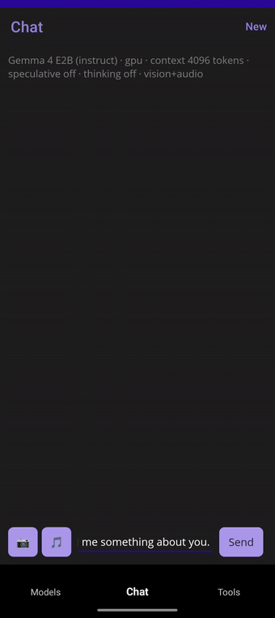
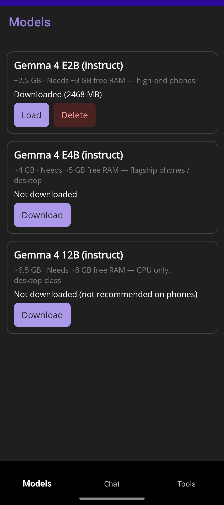
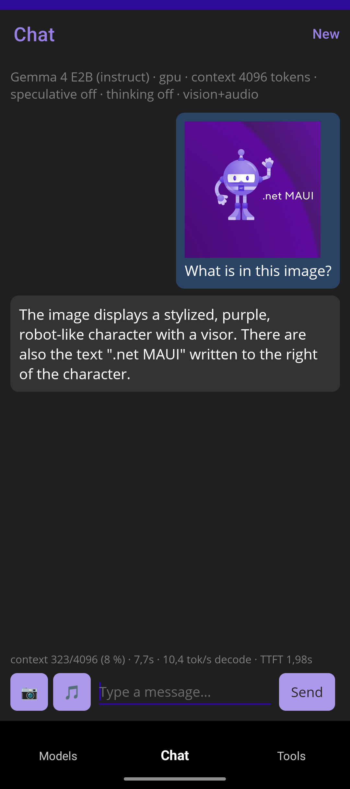
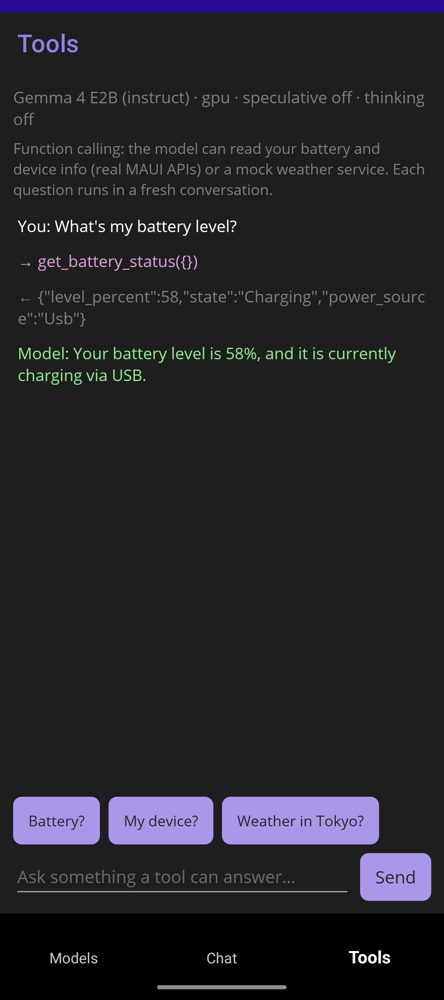

<div align="center">

<!-- PHASE 2 PLACEHOLDER: project logo/banner (docs/images/logo.png) — replace the text title below with
      -->

# LiteRtLmSharp

**Run LLMs on-device from any .NET app — Windows, Linux, Android, macOS, MAUI. No server, no cloud.**

[](https://github.com/OrihuelaConde/LiteRtLmSharp/actions/workflows/ci.yml)
[](https://www.nuget.org/packages/LiteRtLmSharp)
[](https://www.nuget.org/packages/LiteRtLmSharp)
[](https://orihuelaconde.github.io/LiteRtLmSharp/)
[](https://github.com/OrihuelaConde/LiteRtLmSharp/blob/master/LICENSE.txt)

[**Documentation**](https://orihuelaconde.github.io/LiteRtLmSharp/) ·
[**API Reference**](https://orihuelaconde.github.io/LiteRtLmSharp/api/LiteRtLmSharp.html) ·
[**Samples**](#samples) ·
[**Changelog**](https://github.com/OrihuelaConde/LiteRtLmSharp/blob/master/CHANGELOG.md) ·
[**Roadmap**](https://github.com/OrihuelaConde/LiteRtLmSharp/blob/master/docs/roadmap.md)



</div>

.NET 10 bindings for [Google's LiteRT-LM](https://github.com/google-ai-edge/LiteRT-LM) — on-device
LLM inference (e.g. Gemma) via P/Invoke over its C API, with native binaries distributed per-RID as
NuGet packages (LLamaSharp-style). Status: **stable (1.x)**.

| Platform | Native | NuGet | CPU | GPU | Validated on |
|---|:---:|:---:|:---:|:---:|---|
| win-x64 | ✅ | ✅ | ✅ | ✅ | real hardware |
| linux-x64 | ✅ | ✅ | ✅ | ✅ | real hardware |
| android-arm64 | ✅ | ✅ | ✅ | ✅ | real device |
| osx-arm64 | ✅ | ✅ | ✅ | ✅ | CI |
| ios-arm64 | ✅ | ⏳ | — | — | pending |

<sub>**CPU / GPU** = inference validated on that backend. macOS GPU runs in CI on the **WebGPU**
(Dawn→Metal) delegate; the native Metal delegate ships as a real-hardware fallback. The iOS
runtime package ships once on-device validation lands.</sub>

## Quick start

```xml
<PackageReference Include="LiteRtLmSharp" Version="1.2.0" />
<PackageReference Include="LiteRtLmSharp.runtime.win-x64" Version="1.2.0" />
<!-- or LiteRtLmSharp.runtime.linux-x64 / android-arm64 / osx-arm64, per target -->
```

Install the managed package plus the runtime package for your platform, **always with the same
version number**. Which LiteRT-LM native build each release wraps:

| LiteRtLmSharp | LiteRT-LM native |
|---|---|
| 1.2.0 | v0.16.0 (Google's official C API prebuilts) |
| 1.1.1 | v0.14.0 |
| 1.1.0 | v0.14.0 |
| 1.0.0 | v0.13.1 |
| 0.1.0-preview.3 | v0.13.1 |
| 0.1.0-preview.2 | v0.13.1 |
| 0.1.0-preview.1 | v0.13.1 |

```csharp
using LiteRtLmSharp;

using var engine = LiteRtEngine.Load(new LiteRtEngineOptions
{
    ModelPath = "gemma-4-E2B-it.litertlm",   // from huggingface.co/litert-community
    Backend = LiteRtBackend.Cpu,              // or .Gpu (WebGPU -> D3D12/Vulkan/Metal)
    MaxNumTokens = 4096,                       // total context window
});

using var chat = engine.CreateConversation();

// Blocking:
Console.WriteLine(chat.Send("Hello!").Text);

// Awaitable (pass a CancellationToken to cancel mid-generation):
Console.WriteLine((await chat.SendAsync("Hello!")).Text);

// Streaming: each piece is tagged (answer / thinking / tool call):
await foreach (var chunk in chat.SendStreamingAsync("Tell me a joke"))
    Console.Write(chunk.Text);
```

## Features

Every feature has a full guide on the [documentation site](https://orihuelaconde.github.io/LiteRtLmSharp/):

| | |
|---|---|
| **Chat** | Blocking, awaitable + cancellable, and streaming sends — [guide](https://orihuelaconde.github.io/LiteRtLmSharp/chat.html) |
| **Function calling** | Real tool calls with constrained decoding for reliable JSON arguments — [guide](https://orihuelaconde.github.io/LiteRtLmSharp/chat.html#function-calling) |
| **Reasoning mode** | Gemma "thinking", surfaced separately from the answer (blocking & streaming) — [guide](https://orihuelaconde.github.io/LiteRtLmSharp/chat.html#reasoning-mode-thinking) |
| **Multimodal** | Image and audio attachments, in-memory or memory-mapped from disk — [guide](https://orihuelaconde.github.io/LiteRtLmSharp/chat.html#multimodal-messages-image--audio) |
| **Conversation state** | Persist/restore chats across restarts; clone a live conversation to branch it — [guide](https://orihuelaconde.github.io/LiteRtLmSharp/conversation-state.html) |
| **Token counting** | Tokenize/detokenize with the model's own tokenizer; budget the context window — [guide](https://orihuelaconde.github.io/LiteRtLmSharp/chat.html#token-counting-tokenize--detokenize) |
| **Speculative decoding** | MTP drafter support plus a built-in benchmark API (tok/s, TTFT) — [guide](https://orihuelaconde.github.io/LiteRtLmSharp/speculative-decoding.html) |
| **Engine tuning** | Activation precision, prefill chunking, thread counts, cache control — [guide](https://orihuelaconde.github.io/LiteRtLmSharp/engine-tuning.html) |
| **.NET AI ecosystem** | `IChatClient` + Semantic Kernel connectors (below) |
| **AOT & trimming** | Source-generated P/Invoke, no runtime marshalling — Native AOT compatible |

## .NET AI integrations

Two optional companion packages plug the on-device model into the .NET AI ecosystem:

| Package | Exposes the model as | Works with |
|---|---|---|
| [`LiteRtLmSharp.Extensions.AI`](https://orihuelaconde.github.io/LiteRtLmSharp/extensions-ai.html) | `Microsoft.Extensions.AI.IChatClient` | Microsoft Agent Framework, Semantic Kernel, plain MEAI |
| [`LiteRtLmSharp.SemanticKernel`](https://orihuelaconde.github.io/LiteRtLmSharp/semantic-kernel.html) | `IChatCompletionService` | Semantic Kernel |

```csharp
using IChatClient client = new LiteRtChatClient(engine);
Console.WriteLine((await client.GetResponseAsync("One upbeat sentence about on-device AI.")).Text);
// var agent = new ChatClientAgent(client, "You are helpful.");   // Microsoft Agent Framework
```

Function calling (auto-invocation), reasoning content, multimodal and opt-in **stateful
conversations** (MEAI `ConversationId`) are supported — see the
[Extensions.AI guide](https://orihuelaconde.github.io/LiteRtLmSharp/extensions-ai.html) and the
[Semantic Kernel guide](https://orihuelaconde.github.io/LiteRtLmSharp/semantic-kernel.html).

## Samples

<p align="center">
  
  
  
</p>

- [`samples/Maui`](https://github.com/OrihuelaConde/LiteRtLmSharp/tree/master/samples/Maui) — full
  Android/Windows chat app: model download with resume, streaming, multimodal attachments, function
  calling against real device APIs, speculative-decoding and reasoning toggles.
- [`samples/Console`](https://github.com/OrihuelaConde/LiteRtLmSharp/tree/master/samples/Console) —
  chat loop with `--tools`, `--spec` and `--thinking` demos.
- [`samples/SemanticKernel`](https://github.com/OrihuelaConde/LiteRtLmSharp/tree/master/samples/SemanticKernel) —
  kernel registration, streaming, and a `[KernelFunction]` plugin.

## Important notes

- **One engine alive at a time.** Loading a second engine while one is alive throws (it would
  hang in the native layer). To switch model or backend, dispose the conversations and the
  engine, then `LiteRtEngine.Load` again — same pattern as Google's Edge Gallery.
- **`MaxNumTokens`** is the total context window (prompt + response, across turns). Use >= 1024;
  too small can make blocking generation return nothing.
- **Conversations are not thread-safe** — serialize sends per engine (the Microsoft.Extensions.AI
  client does this for you).
- **linux-x64 needs the system Vulkan loader.** The official native library depends on `libvulkan.so.1`
  and does not load without it: `sudo apt install libvulkan1` (Debian/Ubuntu) or your distribution's
  equivalent. No GPU is required for the CPU backend; the loader alone is enough.
- **win-x64 needs no Visual C++ Redistributable** since 1.2.0 (the official library links the CRT
  statically). The GPU backend's shader compiler (`dxcompiler.dll`, `dxil.dll`) ships in the runtime package.
- **Android GPU needs manifest declarations.** Android 12+ only grants access to vendor native
  libraries declared via `<uses-native-library>`; without `libOpenCL.so` the engine silently picks a
  Vulkan path that produces garbage on older Adreno drivers. Copy the `<uses-native-library>` block
  from [the MAUI sample's AndroidManifest](https://github.com/OrihuelaConde/LiteRtLmSharp/blob/master/samples/Maui/Platforms/Android/AndroidManifest.xml).
  Full diagnosis in the [Android guide](https://orihuelaconde.github.io/LiteRtLmSharp/android.html).

## Why .NET 10 only?

.NET 10 is the current LTS. Targeting it exclusively lets the binding use the modern interop stack
as designed — source-generated P/Invoke (`[LibraryImport]`) and `[UnmanagedCallersOnly]` callbacks
with no runtime marshalling, which is what makes it AOT- and trim-compatible — and a single
`net10.0` TFM is directly consumable from `net10.0-android`/`-ios`/`-windows` MAUI apps without
multi-targeting.

## Building from source

Native binaries are **not** committed — restore them into `runtimes/<rid>/native/` from the
`native-v*` GitHub release, then build:

```powershell
pwsh scripts/restore-natives.ps1    # -All for every RID, -Rid android-arm64 for one
dotnet build LiteRtLmSharp.slnx && dotnet test
```

The samples have their own solution (`samples/LiteRtLmSharp.Samples.slnx`; the MAUI sample needs
`dotnet workload install maui`). To run the model-backed tests, point `LITERTLM_TEST_MODEL` at a
`.litertlm` file. CI: [`native-release.yml`](https://github.com/OrihuelaConde/LiteRtLmSharp/blob/master/.github/workflows/native-release.yml)
repackages Google's official LiteRT-LM C API prebuilts for a pinned release (verified against the
upstream release digests, each library inspected) into the `native-v*` release,
[`pack-nuget.yml`](https://github.com/OrihuelaConde/LiteRtLmSharp/blob/master/.github/workflows/pack-nuget.yml)
packs and publishes. Internals docs:
[native ABI](https://orihuelaconde.github.io/LiteRtLmSharp/native-abi.html),
[native build](https://orihuelaconde.github.io/LiteRtLmSharp/native-build.html),
[packaging](https://orihuelaconde.github.io/LiteRtLmSharp/packaging.html).

## Contributing

Issues and PRs are welcome — see [CONTRIBUTING.md](https://github.com/OrihuelaConde/LiteRtLmSharp/blob/master/CONTRIBUTING.md)
for the dev setup and guidelines. Please open an issue first for anything beyond a small fix,
and use [Discussions](https://github.com/OrihuelaConde/LiteRtLmSharp/discussions) for questions.

## License and trademarks

Apache-2.0 (see [LICENSE.txt](https://github.com/OrihuelaConde/LiteRtLmSharp/blob/master/LICENSE.txt),
[NOTICE](https://github.com/OrihuelaConde/LiteRtLmSharp/blob/master/NOTICE) and
[THIRD-PARTY-NOTICES.md](https://github.com/OrihuelaConde/LiteRtLmSharp/blob/master/THIRD-PARTY-NOTICES.md)).

This is an unofficial, community-maintained project. It is **not affiliated with, sponsored,
or endorsed by Google**. LiteRT, LiteRT-LM and Gemma are trademarks of Google LLC. The native
binaries are built from [LiteRT-LM](https://github.com/google-ai-edge/LiteRT-LM) source
(Apache-2.0) at pinned release tags.
