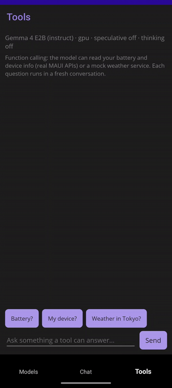

# Chat & generation

The core loop: load a `LiteRtEngine`, create a `LiteRtConversation`, send turns. This guide covers
the generation features in depth — function calling, reasoning mode, multimodal input, and token
counting. Conversation persistence has [its own guide](conversation-state.md), as do
[speculative decoding](speculative-decoding.md) and [engine tuning](engine-tuning.md).

```csharp
using LiteRtLmSharp;

using var engine = LiteRtEngine.Load(new LiteRtEngineOptions
{
    ModelPath = "gemma-4-E2B-it.litertlm",   // from huggingface.co/litert-community
    Backend = LiteRtBackend.Cpu,              // or .Gpu (WebGPU -> D3D12/Vulkan/Metal)
    MaxNumTokens = 4096,                       // total context window
});

using var chat = engine.CreateConversation();

// Blocking:
Console.WriteLine(chat.Send("Hello!").Text);

// Awaitable (pass a CancellationToken to cancel mid-generation):
Console.WriteLine((await chat.SendAsync("Hello!")).Text);

// Streaming: each piece is tagged (answer / thinking / tool call) — see Reasoning mode below.
await foreach (var chunk in chat.SendStreamingAsync("Tell me a joke"))
    Console.Write(chunk.Text);
```

## Function calling

```csharp
using var chat = engine.CreateConversation(new LiteRtConversationOptions
{
    Tools = [ new LiteRtTool("get_weather", "Get weather for a city",
        """{"type":"object","properties":{"location":{"type":"string"}},"required":["location"]}""") ],
    EnableConstrainedDecoding = true,
});

var r = chat.Send("Weather in Tokyo?");
if (r.IsToolCall)
{
    var results = r.ToolCalls.Select(c => new LiteRtToolResult(c.Name, RunTool(c)));
    Console.WriteLine(chat.SendToolResults(results).Text);
}
```

`EnableConstrainedDecoding` grammar-constrains the model's output to valid tool-call JSON — on
small models it is the difference between reliable and flaky arguments. If you use the
[Microsoft.Extensions.AI or Semantic Kernel connectors](extensions-ai.md#function-calling-tools),
their auto-invocation layers sit on top of this same API.

<p align="center">
  
</p>
<p align="center"><sub>Function calling on a phone: the model calls the device's real battery API and answers with the result.</sub></p>

## Reasoning mode (thinking)

Models with a reasoning template (the Gemma builds) can be told to think before answering:

```csharp
using var chat = engine.CreateConversation(new LiteRtConversationOptions
{
    EnableThinking = true,             // Gemma reasoning mode (sets enable_thinking)
    FilterThinkingFromKvCache = true,  // keep the (long) reasoning out of the context window
});
```

The reasoning trace comes back **separate** from the answer — on the blocking `Send` via
`response.Thinking` (and the full `response.Channels` map), and when streaming each
`LiteRtStreamChunk` is tagged by `Kind` (`Answer` / `Thinking` / `ToolCall`):

```csharp
await foreach (var chunk in chat.SendStreamingAsync("Why is the sky blue?"))
    Console.Write(chunk.IsThinking ? $"\n[thinking] {chunk.Text}" : chunk.Text);
```

Reasoning mode is set per-conversation via extra context; for arbitrary template variables use the
raw `ExtraContext` (a JSON-object string) escape hatch; on a model whose template does not use
`enable_thinking` it is a harmless no-op.

## Multimodal messages (image / audio)

On a multimodal model (the Gemma 4 E-series are text + vision + audio), enable the encoder backends at
load time and attach images or audio clips to a turn. The model decodes the bytes — no format hint is
sent.

```csharp
using var engine = LiteRtEngine.Load(new LiteRtEngineOptions
{
    ModelPath = "gemma-4-E2B-it.litertlm",
    Backend = LiteRtBackend.Cpu,
    VisionBackend = LiteRtBackend.Cpu,   // enables image input; null = off
    AudioBackend = LiteRtBackend.Cpu,    // enables audio input; null = off
    MaxNumTokens = 4096,     // leave room for the media's tokens (an image is ~256)
});
using var chat = engine.CreateConversation();   // a plain conversation can send attachments

// Attach in-memory bytes (sent as a base64 blob) ...
byte[] png = File.ReadAllBytes("cat.png");
var reply = chat.Send("What is in this image?", [LiteRtAttachment.Image(png)]);

// ... or a file on disk (memory-mapped natively, no base64 — desktop):
chat.Send("Describe this photo.", [LiteRtAttachment.ImageFile("/photos/sunset.jpg")]);

// Audio works the same way; streaming has matching attachment overloads:
await foreach (var chunk in chat.SendStreamingAsync(
                  "Transcribe this.", [LiteRtAttachment.Audio(wavBytes)]))
    Console.Write(chunk.Text);
```

Attachments follow the text in content-part order; pass several to interleave them. Cap how much of the
context window an image consumes with `LiteRtConversationOptions.VisualTokenBudget`. Vision runs on CPU
or GPU; some models constrain their audio backend (Gemma 4's audio sub-model requires CPU, so
`AudioBackend = LiteRtBackend.Gpu` fails engine creation for it on any platform) — keep audio on CPU when the main
backend is GPU. A plain `CreateConversation()` can send attachments: the binding configures the
conversation for the engine's encoders automatically, so you don't have to set a sampler or output cap.
Just give `MaxNumTokens` room for the media's tokens (an image is ~256). If a send still hits a
multimodal-setup problem the binding throws a `LiteRtException` naming the likely causes (model not
multimodal, `VisionBackend` / `AudioBackend` unset, or `MaxNumTokens` too small). The MAUI sample's Chat
tab exposes 📷 / 🎵 attach buttons (and a modality indicator) for capable models.
Wire-format and validation details:
[native-abi.md](native-abi.md#multimodal-messages-image--audio--verified-wire-format).

## Token counting (tokenize / detokenize)

Measure a prompt's exact token cost, or convert between text and token ids, without running
inference. Useful for budgeting against `MaxNumTokens` before sending.

```csharp
int[] ids = engine.Tokenize("How many tokens is this?");
Console.WriteLine($"{ids.Length} tokens");      // exact count, no generation
string text = engine.Detokenize(ids);           // back to text (surface form)

// The model's start (BOS) and stop (EOS) tokens, each a literal string or a sequence of ids:
foreach (var stop in engine.GetStopTokens())
    Console.WriteLine(stop);                     // e.g. an EOS token id like [1]
```

These call the model's own tokenizer, so the counts match what generation sees. `Tokenize` returns the
raw ids (no chat template); `Detokenize` returns the tokenizer's surface form, so SentencePiece models
(the Gemma builds) render word boundaries as ▁. A start/stop token is a `LiteRtTokenUnion` carrying
either `Text` or `Ids` (its `Kind` says which).

A common use is keeping a conversation inside its context window. The window holds the whole chat
(prompt plus replies, across turns), and overflowing it degrades output, so measure the next turn in
real tokens and react before sending instead of guessing by string length:

```csharp
// contextWindow is the MaxNumTokens you loaded with; leave headroom for the reply.
int next = engine.Tokenize(message).Length;
if (chat.TokenCount + next > contextWindow - replyHeadroom)
    // won't fit: warn the user, shorten the message, or drop old turns and reload via History.
    Warn("Context almost full — shorten the message or start a new chat.");
```

`Tokenize` counts the raw text; for the exact per-turn cost with the chat template included, render the
message first with `chat.RenderMessage(text)` (it returns the templated prompt without sending), then
tokenize that: `engine.Tokenize(chat.RenderMessage(text)).Length`.

## Runnable demos

See [`samples/Console`](https://github.com/OrihuelaConde/LiteRtLmSharp/tree/master/samples/Console)
(`--tools` for the function-calling loop, `--spec` for speculative decoding, `--thinking` for
reasoning mode) and
[`samples/Maui`](https://github.com/OrihuelaConde/LiteRtLmSharp/tree/master/samples/Maui) for a
full Android/Windows chat app with model download, streaming, tools and multimodal attachments.
